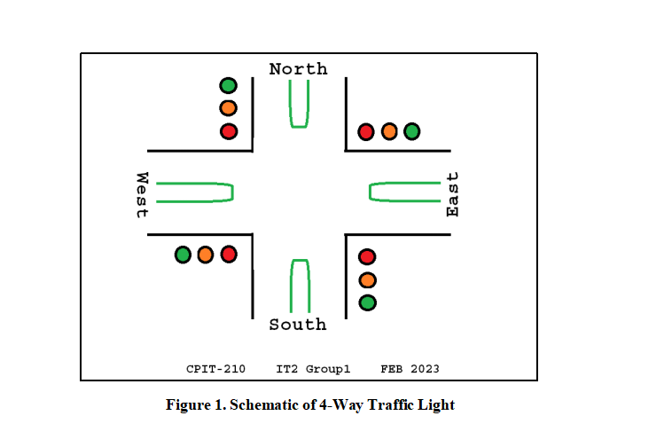
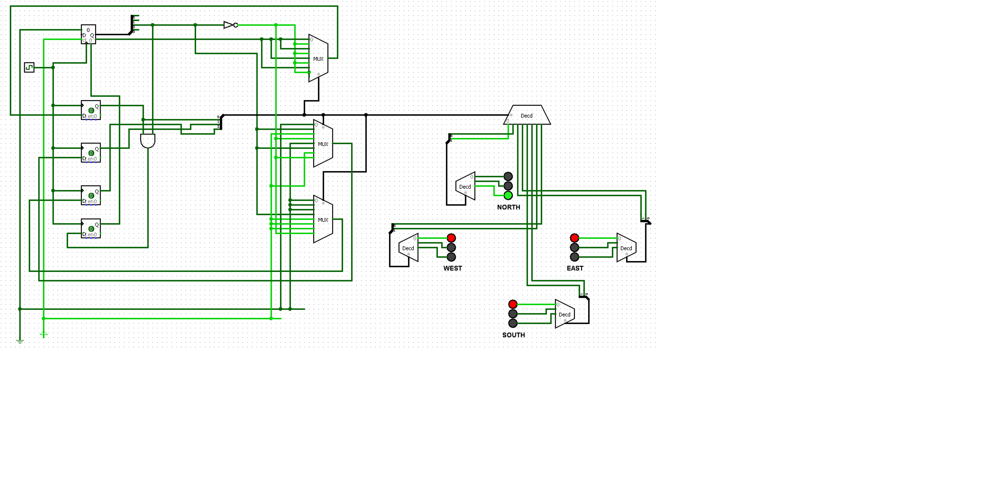
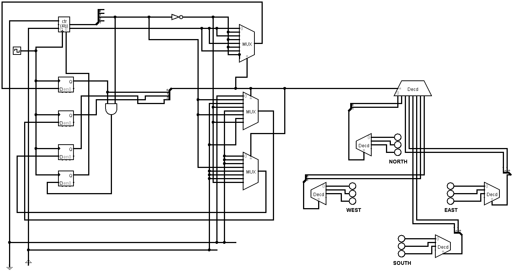

# CPIT210 Course Project
Introduction about your project, describe the problem, and your solution. Project truth tables, expressions, k-maps and any related task must included here. Also project documentation must included.

In this project students should work in groups of 3 to implement a fully functioning sequential circuit. This sequential circuit should work as a Buffer, a competition circuit, or 4-way light circuit depending on the student's choice. The idea of the three projects will be explained in the lab. To design the circuit, Logisim should be used. Students should submit their software implementation and the report here. 

## Group Members
[comment]: <> (each group memeber should write his first, middle and last name with link to his GitHub account)
- [Khaled Ahmed Alghamdi](https://github.com/KhaledAhmedALghamdi)
- [Abdulrahman Majed Alobise](https://github.com/dahmoni1211)
- [ABDULMOHSEN AHMED ALMUTLAQ](https://github.com/Abdulmohsen-almutlaq)

[comment]: <> (Students should include the contribution percentage of each group member.)
[comment]: <> (Example:)
### Contribution:
- ABDULMOHSEN 35%
- Khaled 35%
- Abdulrahman 30%

## Circuit Project topics:

[comment]: <> (Traffic Light)

### Traffic Light
#### Introduction
Traffic light is a signaling device that has an electronic circuit designed to control the flow of traffic at the roads by a specific sequence of lights. Traffic lights were first installed in 1868 in London, and have become widely used all over the world. Currently, there are different standards of traffic signals in the world, depending on the local traffic regulations. In the Kingdom of Saudi Arabia, the following sequence is followed: passing is permitted at green, then ready to stop at yellow, and finally comes to a complete stop at red. The goal for this project is to design and simulate a functioning 4-way traffic light control circuit using digital logic components and Logisim simulation software. The schematic of the 4-way traffic light is shown in Figure 1.

#### Methodology
The first step in the project is to construct the finite-state machine (FSM) or simply the state diagram of the 4-way traffic light which is used to show how the traffic flows. The state diagram can change from one state to another in response to some inputs; the change from one state to another is called a transition which has to be tabulated in what is called transition table. To ensure applying the logic of the traffic light properly, we have to control the inputs and follow certain sequence to switch from state to state. This can be implemented by using counter and selecting the proper flip flops and multiplexers. Therefore, inputs can be passed to traffic light through proper decoders. to ensure the functionality of the logical circuit the software Logisim will be used. Each step of the project including components will be explained and documented.

#### State diagram
The FSM is defined by a list of states, initial state, and inputs that trigger each transition. Initially, all signals in the 4-way traffic light system are red. The system inputs are TG and TA, where TG is the signal to control the time of the green light state, and TA is the signal to control the time of the attention (yellow light) state. The input signals are generated and controlled by a clock and a synchronous binary counter. The first state north green (NG) is when the northern signal is in the green light situation. The inputs to NG state have two modes, the first is 0x and the second is 1x, in both modes the first digit refers to the input variable TG and the second digit refers to the input variable TA. The input mode 0x means the signal of TG is 0 and the signal of TA is x which means in NG we don’t care about TA signal; in this situation the signal will continue in green light. When the input signal is 1x this means TG is 1 which is a signal to move from the first north green state NG to the second state which is north attention state (NA). In attention state TA signal is the controlling signal and we don’t care about TG signal, therefore the input signals will be x0 and x1, where the first means continue in NA and the second means change to third state which is west green (WG). Because we have four ways, the states will keep changing according to the following sequence NG>NA>WG>WA>SG>SA>EG>EA>NG as shown in the Figure 2.

.

##### Transition table
The transition table is basically a tabular representation of the state diagram. It takes two arguments, inputs (TG and TA) and current state (Q0, Q1 and Q2), and returns a state (next state) which are Q0+, Q1+ and Q2+. The transition table is shown in Table 1 and represented by the followings: the first column is the state number (0 to 7), the two inputs in columns 2 and 3, the currents state in columns 4, 5, and 6 and finally the next state in columns7, 8, and 9.  Since we have 8 states therefore, we need 3 D-type Flip Flops to control the transition and corresponding inputs. Table 2 is showing the transition table after adding the flip-flop excitation values required to produce the state change. The functions of D's to get Q's in transition table is derived using k-map as shown in Figure 3.

##### transition implementation
The D's are implemented using three 8x1 multiplexers, the input of each multiplexer pin is derived from the transition table. As shown in Figure 4, if the select of MUX-1 is Q0=0, Q1=0, and Q2=0 therefore the input on the first pin of multiplexer is TG, and if the select is Q0=1, Q1=0, and Q2=0 therefore the input on the second pin is the complement of TA and so on. This procedure will be applied to the two other multiplexers MUX-2 and MUX-3 as shown in Figure 5. According to the output of the multiplexers each one of the three Flip Flops will generate one of the state inputs (Q0, Q1, and Q2) according the required sequence while the fourth flip flop is used to reset the counter after complete cycle (16 bits for green light and 4 bits for yellow light). As shown in Figure 6,  these inputs will go back to the multiplexers to generate the next state and at the same time will be used to control the traffic light which will be discussed in the following section.

#### Circuit Explanation

Multiplexers:
Here I will explain some things like:
1-how many Multiplexers do we have?
2-What is the input of the Multiplexers?
3-what is the benefit of selection output?

First of all, we have 3 Multiplexers, each one takes 8 inputs and gives 1 output from 1 D flip-flop, and each D flip-flop has different inputs, that depend on the truth table of the traffic lights

This is the picture of the inputs that each D flip-flop has. Finally, what is the benefit of the selection output? The benefit of selection is to identify which inputs become outputs.

Decoders:

Here I will explain some things like:
1-	how many Decoders do we have?
2-	What are the inputs and what are the outputs
3-	explain how it’s works

State inputs (Q0, Q1, and Q2) generated by the three flip flops will be the input to the 8x3 decoder which will control the four traffic lights by using four 4x2 decoders as shown in Figure 7. The control logic will be according to the inputs and outputs shown in Table 3. In the first state which corresponding to the input Q0=0, Q1=0, and Q2=0, the green light of the north traffic light is ON therefore the input to North decoder will be BN=1 and AN=0 while the rest three decoders have inputs of 0's which means all corresponding lights are red. In the second state Q0=1, Q1=0, and Q2=0 the input to North decoder will be BN=0 and AN=1 which means the yellow light of the north traffic light is ON while the rest of lights are red. Similarly, the sequence will continue for the rest of traffic lights according to the input (Q's). Using K-map each state has its own function as shown in Figure 8. 

How the circuit counter is work:

First of all, we pulse the clock to increase the number of the counter, and the counter is responsible to enable the green light, and after the time of the green light finish, switch the light to the yellow light, in this circuit we set the yellow light time to 4 seconds, so if the counter was 4 seconds, the And gate will active and enable the last D flip-flop, and the last D flip-flop is responsible for resetting the counter. Finally, the next traffic light will change the light from red to green.

## Grading Factors
Each student's grade will defer from his group-mate 
- content and organization
- stating the problem need to be solved
- explanation of each component used
- explanation of whole circuit/integration of component
- how often you update/participate/contribute in group repository

## Deadline
Monday 29 / 7 / 1444 H, *20 Feb. 2023*

## Logic Expression
Include exported image from Logisim of your project here. *(Screenshot is not accepted!)*

